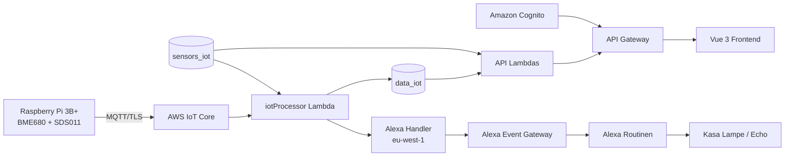

# Architektur

## Gesamtübersicht

## Verantwortlichkeiten

### Raspberry Pi

- liest Sensorwerte
- kennt keine Cognito-User-ID
- sendet nur Geräte-ID, Typ und Messwerte
- startet automatisch per systemd

### AWS IoT Core

- MQTT-Endpunkt
- TLS-Zertifikatsprüfung
- Übergabe an Lambda über IoT-Regel

### `iotProcessor`

- ordnet Messung einem Benutzer zu
- ergänzt Raum und Sensorbezeichnung
- erstellt UTC-Zeitstempel
- speichert in `data_iot`
- triggert Alexa-Auswertung asynchron

### API-Lambdas

- CRUD für Sensoren und Raumkonfigurationen
- Laden historischer Messdaten
- Echtzeit- und WHO-Auswertung
- Cognito-basierte Benutzertrennung

### Frontend

- Login
- Sensorverwaltung
- Visualisierung
- Warnanzeige
- Diagramme

### Alexa

- erhält SimpleEventSource-Events
- Routinen setzen Lampenfarbe und optional Sprachausgabe
